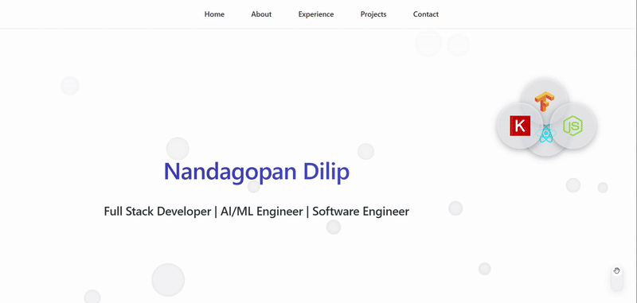

# Portfolio Website

## Demo



## Features

- 🌓 Dark/Light mode toggle
- 📱 Fully responsive design
- 🎨 Modern and clean interface
- 🚀 Fast performance
- 📧 Contact form with EmailJS integration
- 🔗 Social media links
- 🎯 Interactive project filtering
- 💻 Project showcase with live demos
- 🌟 Skills and experience timeline

## Tech Stack

- React with TypeScript
- Vite for build tooling
- CSS3 with custom properties
- EmailJS for contact form
- Intersection Observer API
- GitHub Pages for hosting

## Getting Started

### Prerequisites

- Node.js (v18 or higher)
- npm (v9 or higher)

### Installation

1. Clone the repository

```bash
git clone https://github.com/YourUsername/portfolio-website.git
cd portfolio-website/portfolio-app
```

2. Install dependencies

```bash
npm install
```

3. Create a `.env` file in the portfolio-app directory and add your EmailJS credentials:

```
VITE_EMAILJS_SERVICE_ID=your_service_id
VITE_EMAILJS_TEMPLATE_ID=your_template_id
VITE_EMAILJS_PUBLIC_KEY=your_public_key
```

4. Start the development server

```bash
npm run dev
```

## Project Structure

```
portfolio-app/
├── src/
│   ├── components/    # Reusable UI components
│   ├── sections/      # Main page sections
│   ├── styles/        # Global styles and themes
│   └── assets/        # Images and other static files
├── public/           # Public assets
└── index.html        # Entry point
```

## Deployment

To deploy to GitHub Pages:

```bash
npm run deploy
```

## Customization

1. Update `src/content.ts` with your personal information
2. Modify theme colors in `src/styles/theme.css`
3. Add your projects in `src/sections/projects_section.tsx`
4. Update social links in `src/components/social_links_component.tsx`

## Contributing

Pull requests are welcome. For major changes, please open an issue first to discuss what you would like to change.

## License

[GNU](LICENSE)

## Contact

Nandagopan Dilip - [in/nandagopan-dilip](https://www.linkedin.com/in/nandagopan-dilip/)

Project Link: [https://github.com/nandusss/portfolio-website](https://github.com/nandusss/portfolio-website)
